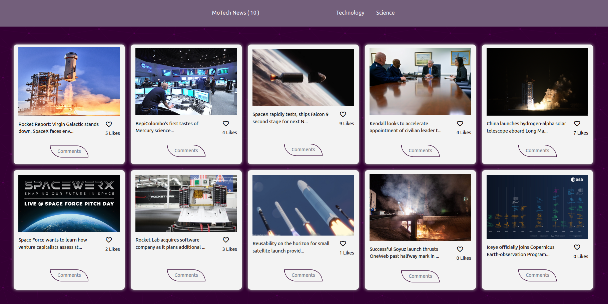
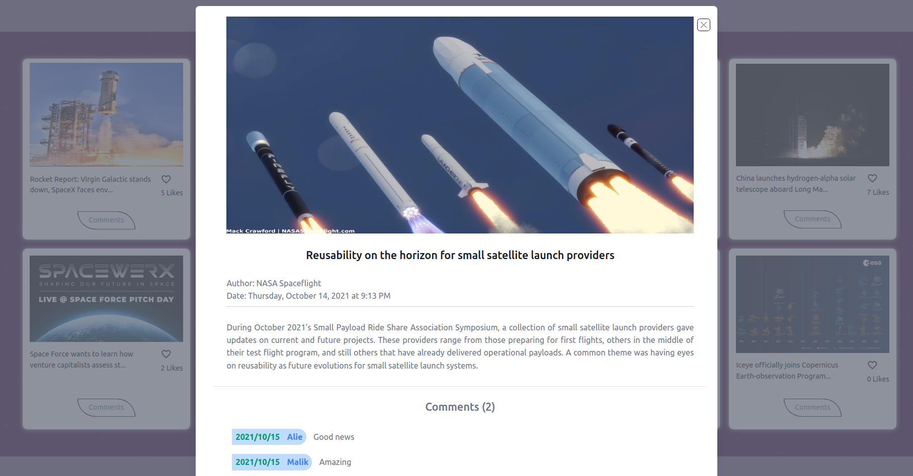
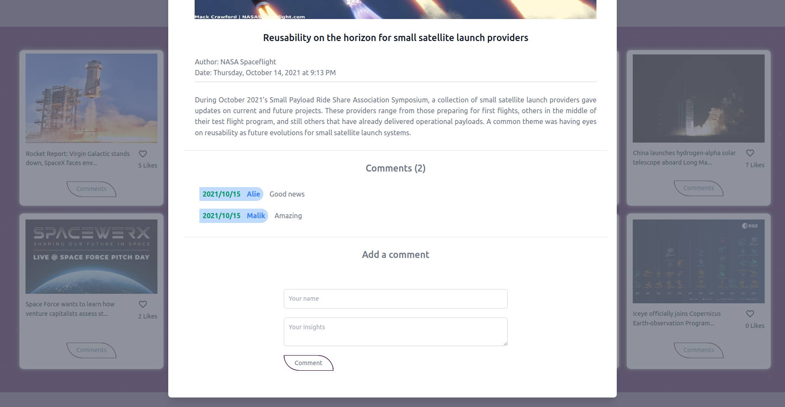
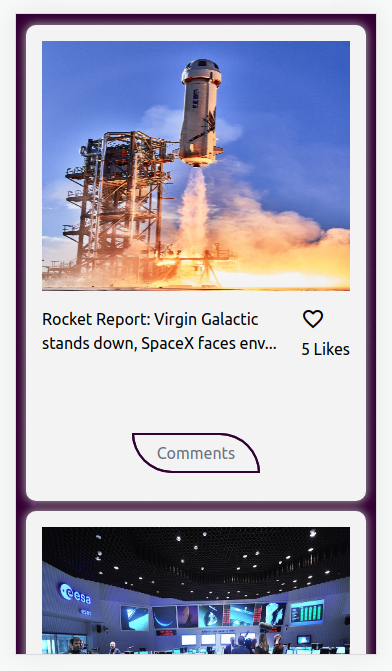
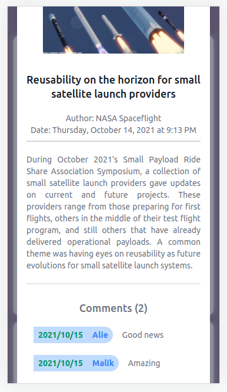
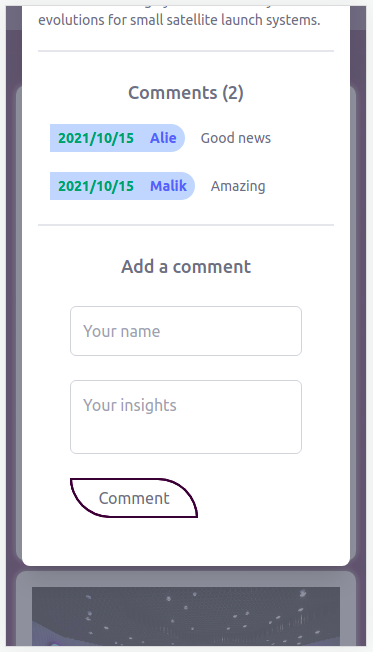
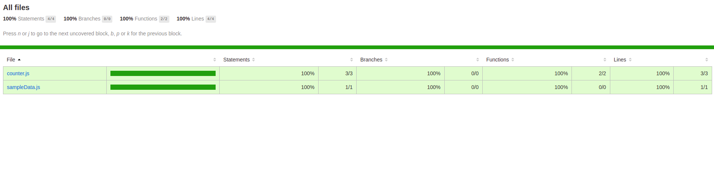

# Modern Technology News

> The name of the project is called **Modern Technology News (MoTech News)**. MoTech News reads data from [Inshortsapi API service.](https://inshortsapi.vercel.app/news?category=technology) to get updated news and populate them on the website. The application also leverage the [Involvement API Service](https://www.notion.so/microverse/Involvement-API-869e60b5ad104603aa6db59e08150270) in order to allow users to leave comments and likes for a particular news.

Gif Demo                                                                                                                                 |
:---------------------------------------------------------------------------------------------------------------------------------------:|
                                                                                               |

Desktop view 1                               |Desktop view 2                               |Desktop view 3                               |
:-------------------------------------------:|:-------------------------------------------:|:-------------------------------------------:|
            |            |            |

Mobile view 1                                |Mobile view 2                                |Mobile view 3                                |
:-------------------------------------------:|:-------------------------------------------:|:-------------------------------------------:|
            |            |            |


Test Covereage                                                                                                                           |
:---------------------------------------------------------------------------------------------------------------------------------------:|
                                                                                               |

## Online version
[Demo](https://benmukebo.github.io/javascript-capstone/)

## Link to video
[Project explanation video](https://drive.google.com/file/d/1KPlcbsX3nQ8DPLIQ3ErletsJrqsyMWIF/view?usp=sharing)

## Built With

- HTML / CSS / JAVASCRIPT / WEBPACK

## How to run the program locally
- Clone the project: ```https://github.com/BenMukebo/javascript-capstone.git```
- Skip if you already have node installed otherwise download [nodejs](https://nodejs.org/en/download/) install it on your system
- Install the node modules: ```npm install```
- Run the app: ```npm start``` or ```yarn start```

## How to run the tests
- Clone the project: ```https://github.com/BenMukebo/javascript-capstone.git```
- Skip if you already have node installed otherwise download [nodejs](https://nodejs.org/en/download/) install it on your system
- Install the node modules: ```npm install```
- Run the tests: ```npm test```

## Author

👤 **Ben Mukebo**

- GitHub: [@BenMukebo](https://github.com/BenMukebo)

## Collaborator

👤 **Muhammad Mustapha Sesay**

- GitHub: [@mmsesay](https://github.com/mmsesay)
- Twitter: [@DeeMaejor](https://twitter.com/DeeMaejor)
- LinkedIn: [LinkedIn](https://linkedin.com/in/muhammad-m-sesay)

## 🤝 Contributing

Contributions, issues, and feature requests are welcome!

Feel free to check the [issues page](../../issues/).

## Show your support

Give a ⭐️ if you like this project!

## Acknowledgments
- microverseinc for the readme template
- [Spaceflights API service.](https://api.spaceflightnewsapi.net/v3/documentation#)
- [Involvement API Service](https://www.notion.so/microverse/Involvement-API-869e60b5ad104603aa6db59e08150270)
